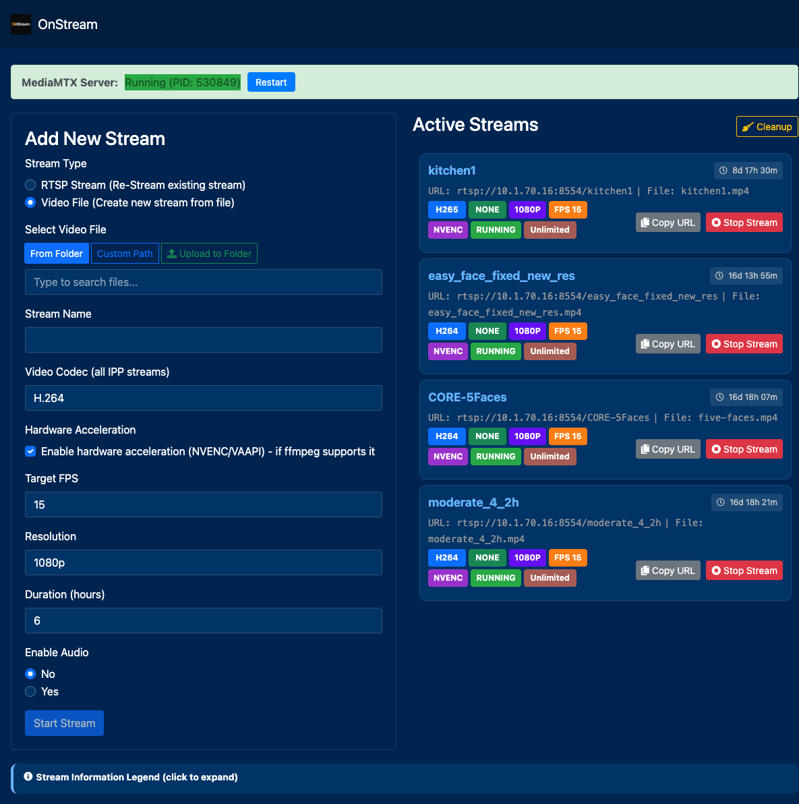
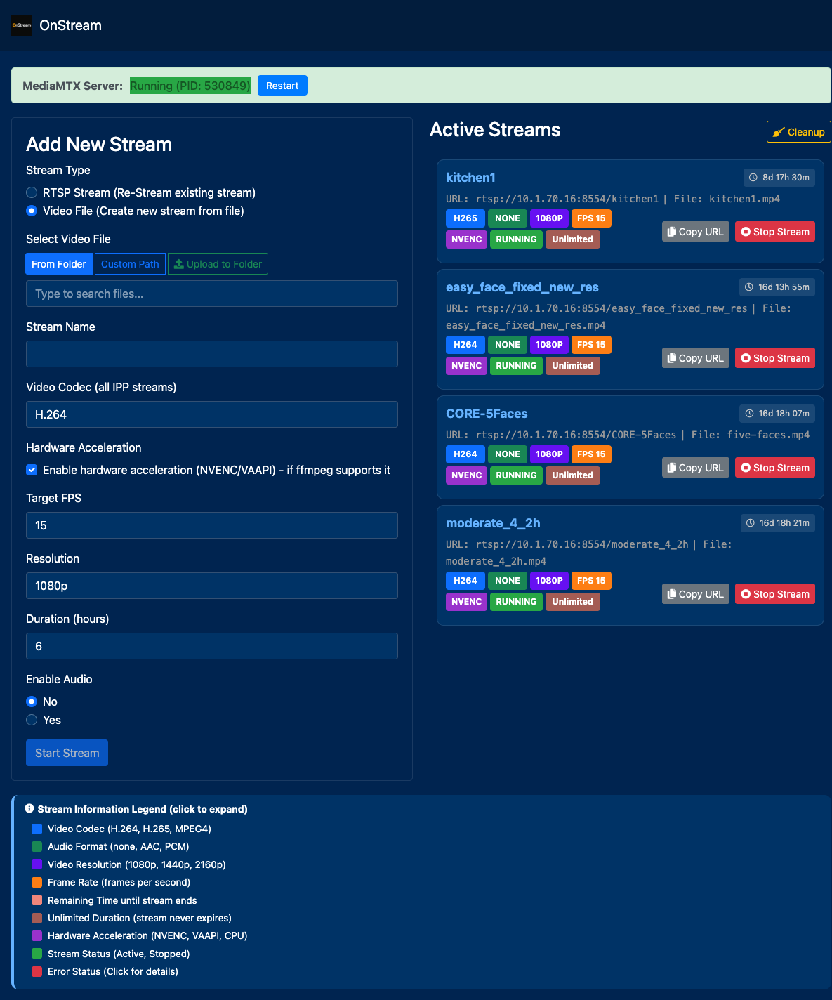

# StreamAlchemy 🎬

> **Professional Video Streaming Platform** - Transform any video source into RTSP streams with advanced encoding, monitoring, and management capabilities.

[](https://opensource.org/licenses/MIT)
[](https://www.python.org/downloads/)
[](https://flask.palletsprojects.com/)

## 🚀 Features

### Multi-Source Streaming
- **RTSP Streams** - Connect to existing RTSP sources
- **Local Video Files** - Stream from MP4, MKV, AVI, MOV, WebM, FLV, M4V files
- **YouTube Integration** - Stream YouTube videos and live streams via yt-dlp

### Advanced Encoding
- **Video Codecs** - H.264, H.265, MPEG-4 support
- **Resolutions** - 480p, 720p, 1080p, 1440p, 2160p
- **Hardware Acceleration** - NVENC, VAAPI support for optimal performance
- **Audio Control** - AAC, PCM audio codecs with enable/disable options
- **Custom FPS** - Configurable frame rates

### Professional Management
- **Web Interface** - Clean, responsive UI for stream management
- **Real-time Monitoring** - CPU, memory, and duration tracking
- **Health Monitoring** - Automatic stream cleanup and error detection
- **Stream Persistence** - Survives server restarts
- **Advanced Logging** - Rotating logs with syntax highlighting and search

### Production Ready
- **Systemd Service** - Run as a system service
- **Docker Support** - Containerized deployment
- **Configuration Management** - Environment-based configuration
- **Security** - Input validation and secure file handling

## 📋 Requirements

- **Python 3.8+**
- **FFmpeg** (with hardware acceleration support recommended)
- **yt-dlp** (for YouTube support)
- **Linux/macOS** (Windows support experimental)

## 🛠️ Quick Start

### 1. Clone and Setup
```bash
git clone https://github.com/TCyberChef/StreamAlchemy.git
cd StreamAlchemy/python_interface
```

### 2. Install Dependencies
```bash
# Make run script executable
chmod +x run.sh

# Run the application (handles venv setup and dependencies)
./run.sh
```

### 3. Access Web Interface
Open your browser to `http://localhost:5000`

## 📸 Screenshots

### Main Interface


### Active Streams Management


*Live demo running at: http://10.1.70.16:5000/*

## 🎯 Usage

### Starting a Stream

1. **Choose Stream Type**:
   - RTSP Stream: Enter RTSP URL
   - Video File: Provide absolute path to video file
   - YouTube: Paste YouTube URL

2. **Configure Settings**:
   - Stream name (unique identifier)
   - Video codec and resolution
   - Audio settings
   - Duration (or unlimited)
   - Hardware acceleration

3. **Monitor Streams**:
   - View active streams with real-time status
   - Access detailed logs
   - Stop streams as needed

### Stream URLs
Active streams are available at:
```
rtsp://[server-ip]:8554/[stream-name]
```

## ⚙️ Configuration

### Environment Variables
```bash
# Server settings
STREAM_ALCHEMY_HOST=0.0.0.0
STREAM_ALCHEMY_PORT=5000

# Health monitoring
MAX_CPU_USAGE=90
MAX_MEMORY_USAGE=2048
MAX_STREAM_DURATION=172800  # 48 hours

# Features
ENABLE_HEALTH_MONITORING=true
ENABLE_YOUTUBE_SUPPORT=true
ENABLE_HARDWARE_ACCEL=true
```

### Configuration File
Edit `python_interface/config.py` for detailed settings.

## 🏗️ Architecture

```
StreamAlchemy/
├── python_interface/          # Main Flask application
│   ├── app.py                # Core application logic
│   ├── config.py             # Configuration management
│   ├── static/               # Web assets (CSS, JS, images)
│   ├── templates/            # HTML templates
│   └── requirements.txt      # Python dependencies
├── mediamtx/                 # RTSP server
│   ├── mediamtx             # MediaMTX binary
│   └── mediamtx.yml         # Server configuration
└── docs/                     # Documentation
```

## 🔧 Advanced Setup

### Systemd Service
```bash
# Copy service file
sudo cp stream_alchemy.service /etc/systemd/system/

# Edit paths in service file
sudo nano /etc/systemd/system/stream_alchemy.service

# Enable and start
sudo systemctl enable stream_alchemy
sudo systemctl start stream_alchemy
```

### Docker Deployment
```bash
# Build image
docker build -t streamalchemy .

# Run container
docker run -p 5000:5000 -p 8554:8554 streamalchemy
```

## 📊 Monitoring

### Health Checks
- **CPU Usage**: Automatic termination at 90% (configurable)
- **Memory Usage**: Automatic termination at 2GB (configurable)
- **Duration Limits**: Maximum 48-hour stream duration
- **Error Detection**: Automatic cleanup of failed streams

### Logging
- **Application Logs**: Main application events
- **Stream Logs**: Individual stream output and errors
- **Crash Reports**: Detailed failure analysis
- **Log Rotation**: Automatic cleanup and rotation

## 🤝 Contributing

We welcome contributions! Please see our [Contributing Guidelines](CONTRIBUTING.md) for details.

### Development Setup
```bash
# Clone repository
git clone https://github.com/TCyberChef/StreamAlchemy.git
cd StreamAlchemy

# Create virtual environment
python -m venv venv
source venv/bin/activate  # On Windows: venv\Scripts\activate

# Install dependencies
pip install -r python_interface/requirements.txt

# Run tests
python python_interface/automated_tester.py
```

## 📄 License

This project is licensed under the MIT License - see the [LICENSE](LICENSE) file for details.

## 🙏 Acknowledgments

- **FFmpeg** - Video processing engine
- **MediaMTX** - RTSP server
- **Flask** - Web framework
- **yt-dlp** - YouTube integration

## 📞 Support

- **Issues**: [GitHub Issues](https://github.com/TCyberChef/StreamAlchemy/issues)
- **Discussions**: [GitHub Discussions](https://github.com/TCyberChef/StreamAlchemy/discussions)
- **Documentation**: [Wiki](https://github.com/TCyberChef/StreamAlchemy/wiki)

---

**Made with ❤️ by [TCyberChef](https://github.com/TCyberChef)**

*StreamAlchemy - Where video streaming meets professional-grade management*
